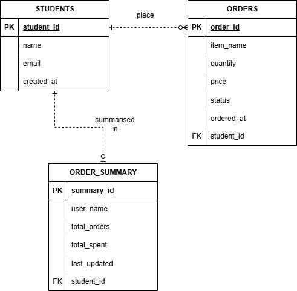

# Distributed DB Demo — Student Order System

A PHP demo project showing how to build a system that reads and writes across
**three separate database engines** (MariaDB, MySQL, PostgreSQL) running on
**different machines** connected via **Tailscale**.

> 📺 **Video walkthrough:** _link coming soon_ <!-- TODO: replace with YouTube URL once uploaded -->

---

## What This Demo Shows

| Page | What it teaches |
|---|---|
| `setup/test_connections.php` | How to verify remote DB connectivity |
| `pages/index.php` (Dashboard) | How distributed nodes fail independently |
| `pages/register.php` | Write to a remote MariaDB from PHP |
| `pages/orders.php` | Cross-node write: verify on Node A → insert on Node B → sync to Node C |
| `pages/reports.php` | Application-level join across 3 separate servers |

---

## Architecture

```
Node A (Linux)    Node B (Windows)    Node C (any OS)
MariaDB           MySQL               PostgreSQL
node_a_users      node_b_orders       node_c_reports
    ▲                  ▲                   ▲
    └──────────────────┼───────────────────┘
                       │
              PHP web server
              (runs on one machine)
              connects to all 3 via Tailscale
```

All three machines must be on **Tailscale** — a free VPN that gives each
device a stable `100.x.x.x` IP regardless of which Wi-Fi network it's on.

---

## Entity Relationship Diagram



### Cardinality Constraints

The ERD shows two relationships between entities, each with its own participation rule.

**STUDENTS → ORDERS** (`||--o{`) — labeled *"place"*

| Side | Symbol | Rule |
|---|---|---|
| ORDERS | `\|\|` | Every order must belong to **exactly one** student — an order cannot exist without a student |
| STUDENTS | `o{` | A student may have **zero or many** orders — students are not required to place any orders |

This is called a **1:N (one-to-many)** relationship with **partial participation** on the STUDENTS
side (they don't have to place orders) and **total participation** on the ORDERS side (every order
must have an owner).

**STUDENTS → ORDER_SUMMARY** (`||--o|`) — labeled *"summarised in"*

| Side | Symbol | Rule |
|---|---|---|
| ORDER_SUMMARY | `\|\|` | Every summary row must reference **exactly one** student |
| STUDENTS | `o\|` | A student may have **zero or one** summary row — the row is only created after the student's first order |

This is a **1:0..1 (one to zero-or-one)** relationship. A student with no orders has no summary row.

> **Important:** Neither relationship uses a real database foreign key. `ORDERS.student_id` and
> `ORDER_SUMMARY.student_id` both point to `STUDENTS.student_id` on a completely different server
> (Node A). The database engine cannot enforce this — PHP enforces it instead by querying Node A
> to verify the student exists before writing to Node B or Node C.

### What is a Node?

A **node** in this project is a single machine running one database engine.
Each node is a separate physical (or virtual) computer on the Tailscale network:

| Node | Machine | Engine | Stores |
|---|---|---|---|
| Node A | Linux machine | MariaDB | Student identity — `STUDENTS` table |
| Node B | Windows machine | MySQL | Order transactions — `ORDERS` table |
| Node C | Any OS | PostgreSQL | Aggregated report cache — `ORDER_SUMMARY` table |

**A "machine" can be anything that has a network connection and can run a database**, for example:

- Your own laptop (e.g. Node A runs on your Windows laptop)
- A teammate's laptop across the room or across the country
- A VirtualBox or VMware VM running on your laptop (the VM counts as a separate machine)
- A WSL2 (Windows Subsystem for Linux) instance on your Windows PC
- A cloud VM (e.g. AWS EC2, Google Cloud, DigitalOcean droplet)
- A Raspberry Pi on your desk

For this demo, the simplest setup is **three teammates, each using their own laptop** — one runs
MariaDB, one runs MySQL, one runs PostgreSQL. Tailscale connects them all.

The PHP web server is **not** a node — it is a separate machine that connects to all three nodes
over Tailscale and acts as the middle layer between the browser and the databases.

The key point: each node runs independently. If Node B goes down, Node A and Node C are still
reachable. The system degrades gracefully rather than failing completely.

### What is Tailscale and Why Do We Need It?

Each node in this project runs on a **different physical machine**. For PHP to connect to a
database on another machine, that machine must be reachable over a **network** — specifically,
it needs a stable IP address that PHP can dial into.

The problem with normal Wi-Fi networks is that IP addresses change. When your laptop joins a
different Wi-Fi network, it gets a new local IP. If your teammate's machine is on a completely
different network (e.g. at home vs. at university), local IPs won't work at all — machines on
separate networks cannot reach each other directly.

**Tailscale solves this.** It creates a private **overlay network** (a virtual network on top of
the internet) that connects all your machines as if they were plugged into the same router.
Every machine on your Tailscale network gets a permanent `100.x.x.x` IP address that never
changes, regardless of which Wi-Fi it is on.

**Why not just use the university Wi-Fi IP?**
Local IPs (e.g. `192.168.x.x`) only work when all machines are on the same network. The moment
one teammate goes home or connects to a different hotspot, those IPs stop working. Tailscale IPs
always work — over Wi-Fi, mobile data, or across countries.

#### How to install Tailscale

1. Go to [https://tailscale.com/download](https://tailscale.com/download) and download the
   installer for your operating system (Windows, Linux, macOS).
2. Install and sign in with a Google or GitHub account. Everyone in your group must sign in to
   the **same Tailscale account (tailnet)** — or the admin must invite the others.
3. Once connected, each machine appears in the Tailscale dashboard with a `100.x.x.x` IP.

#### Verify the network is working with ping

After all machines are connected to Tailscale, verify they can reach each other using `ping`.
Open a terminal on the PHP web server machine and ping each node by its Tailscale IP:

```bash
ping 100.x.x.1   # Should get replies from Node A
ping 100.x.x.2   # Should get replies from Node B
ping 100.x.x.3   # Should get replies from Node C
```

If `ping` gets replies, the **network is working** and PHP will be able to open a database
connection to that machine. If `ping` times out, the machine is either offline, not connected
to Tailscale, or has a firewall blocking ICMP — fix this before touching `config.php`.

> Full step-by-step Tailscale setup: [`setup/tailscale_guide.md`](setup/tailscale_guide.md)

---

## Setup — Read This In Order

### 1. Install and Connect Tailscale

Follow the full guide: [`setup/tailscale_guide.md`](setup/tailscale_guide.md)

After setup, every machine should be able to ping the others:
```bash
ping 100.x.x.x   # Tailscale IP of teammate's machine
```

### 2. Set Up Each Database Node

Run the SQL file for each node **on the machine that hosts that DB**.

Before importing, you need to **create a database first** inside your DBMS. You can name it
anything you like — the SQL files will create the proper internal database name automatically,
but your DBMS needs an entry point to connect to first.

---

**Node A — MariaDB (Linux machine):**

Open your MariaDB client and create a database, for example:
```sql
CREATE DATABASE IF NOT EXISTS workshop;
```
Then import the schema from the terminal:
```bash
mysql -u root -p workshop < db/node_a_mariadb.sql
```

---

**Node B — MySQL (Windows machine):**

Open MySQL Workbench (or the MySQL command line) and create a database, for example:
```sql
CREATE DATABASE IF NOT EXISTS workshop;
```
Then import from Command Prompt:
```bash
mysql -u root -p workshop < db\node_b_mysql.sql
```

---

**Node C — PostgreSQL (any machine):**

Open pgAdmin or psql and create a database, for example:
```sql
CREATE DATABASE workshop;
```
Then connect to it and import:
```bash
psql -U postgres -d workshop -f db/node_c_postgres.sql
```

> **PostgreSQL extra step:** You must also configure remote access.
> See [`docs/environment.md`](docs/environment.md) — "PostgreSQL Remote Access Configuration".

### 3. Create config.php

`config.php` is gitignored and never committed (it holds real IPs and passwords).
You must create it yourself by copying the example template:

```bash
# Windows
copy config.example.php config.php

# Linux / macOS
cp config.example.php config.php
```

Then open `config.php` and replace the placeholder IPs with your actual Tailscale IPs:

```php
define('DB_A_HOST', '100.x.x.1');   // ← Node A's Tailscale IP
define('DB_B_HOST', '100.x.x.2');   // ← Node B's Tailscale IP
define('DB_C_HOST', '100.x.x.3');   // ← Node C's Tailscale IP
```

> `config.example.php` is the committed template. `config.php` is your local copy — never commit it.

### 4. Enable PHP Extensions

Check that your PHP installation has the required extensions:
```bash
php -m | grep pdo
# Must show: pdo, pdo_mysql, pdo_pgsql
```

If `pdo_pgsql` is missing:
```bash
# Ubuntu/Debian
sudo apt install php-pgsql
sudo systemctl restart apache2
```

See [`docs/environment.md`](docs/environment.md) for Windows instructions.

### 5. Run the Connection Test

Open this page in your browser:
```
http://localhost/distributed-db-demo/setup/test_connections.php
```

All three nodes must show **✅ Connected**. If any show red, see
[`docs/troubleshooting.md`](docs/troubleshooting.md).

### 6. Open the Dashboard

```
http://localhost/distributed-db-demo/pages/index.php
```

---

## PHP Version and Extensions Required

| Requirement | Details |
|---|---|
| PHP | 8.0 or higher |
| `pdo_mysql` | For Node A (MariaDB) and Node B (MySQL) |
| `pdo_pgsql` | For Node C (PostgreSQL) |
| Web server | Apache, Nginx, or `php -S localhost:8080` |

---

## Project Structure

```
config.php          ← Edit this first: put your Tailscale IPs here
pages/              ← The demo pages (open these in browser)
includes/           ← DB connection helpers
db/                 ← SQL setup scripts (run once per node)
setup/              ← Connection test + Tailscale guide
docs/               ← Technical reference
context/            ← Agent context for Claude Code (skip if not using AI)
```

Full structure: [`docs/folder-structure.md`](docs/folder-structure.md)

---

## Key Things to Understand

**Why can't we use foreign keys across nodes?**
Database engines only enforce constraints within their own server. A foreign
key in MySQL on Node B cannot reference a table in MariaDB on Node A —
they're on different machines. Your PHP code must enforce this manually.
See how `pages/orders.php` verifies the user on Node A before writing to Node B.

**Why does the dashboard still work when one node is down?**
Each node query is wrapped in its own `try/catch`. A failure on Node B only
affects the Orders column — it doesn't crash the page. This is the core
concept of distributed system fault tolerance.

**Why is PostgreSQL different?**
PostgreSQL uses a different PDO driver (`pgsql:` DSN vs `mysql:`), different
auto-increment syntax (`SERIAL` vs `AUTO_INCREMENT`), and requires explicit
config changes to accept remote connections (`pg_hba.conf`).
These differences are intentionally visible in the code.

---

## Troubleshooting

See [`docs/troubleshooting.md`](docs/troubleshooting.md) for solutions to
all common connection and PHP errors.

If stuck, copy the exact error message from `setup/test_connections.php`
and bring it to your instructor.

---

## Technical Docs

| Document | What it covers |
|---|---|
| [`docs/database.md`](docs/database.md) | Schema for all 3 nodes |
| [`docs/architecture.md`](context/architecture.md) | How the system fits together |
| [`docs/requirements.md`](docs/requirements.md) | Functional and non-functional requirements |
| [`docs/domain-rules.md`](docs/domain-rules.md) | Business rules (e.g. no cross-server FKs) |
| [`docs/environment.md`](docs/environment.md) | config.php reference, PHP extensions |
| [`docs/troubleshooting.md`](docs/troubleshooting.md) | Common errors and fixes |
