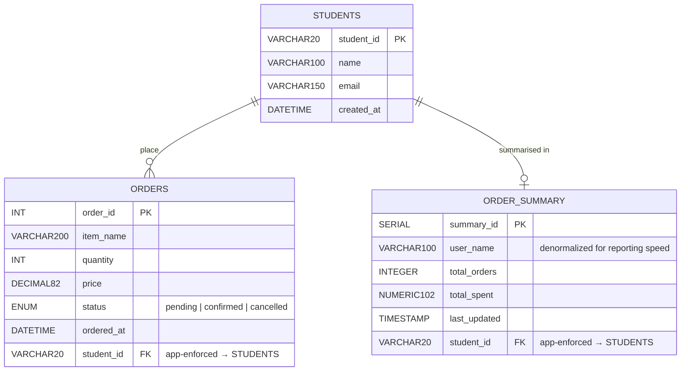

# Entity Relationship Diagram

This project spans **three separate databases** across three nodes. There are no foreign key
constraints between nodes — referential integrity is enforced in application code (PHP).

Dashed lines represent logical (cross-node) relationships. Solid lines represent real FK constraints.



## Node summary

| Node | Engine     | Database         | Table           | Role                              |
|------|------------|------------------|-----------------|-----------------------------------|
| A    | MariaDB    | `node_a_users`   | `STUDENTS`      | Identity — student accounts       |
| B    | MySQL      | `node_b_orders`  | `ORDERS`        | Transactions — individual orders  |
| C    | PostgreSQL | `node_c_reports` | `ORDER_SUMMARY` | Aggregates — reporting cache      |

## Cross-node reference notes

- `ORDERS.student_id` and `ORDER_SUMMARY.student_id` both mirror `STUDENTS.student_id` from Node A.
- Because the tables live on different servers, the database engine cannot enforce these as real
  foreign keys. The PHP pages (`orders.php`, `reports.php`) must validate that the `student_id`
  exists on Node A before writing to Node B or Node C.
- `ORDER_SUMMARY.user_name` is intentionally denormalized: fetching the name on every report
  query would require a live cross-node join, which is fragile. The name is copied at write time.

---

## ASCII ERD

```
  NODE A — MariaDB (node_a_users)
  ┌──────────────────────────────┐
  │           STUDENTS           │
  ├──────────────────────────────┤
  │ PK  student_id  VARCHAR(20)  │
  │     name        VARCHAR(100) │
  │     email       VARCHAR(150) │
  │     created_at  DATETIME     │
  └───────────────┬──────────────┘
                  ‖ place (1)          summarised in (1)
          ┌───────┴───────┐
          │               │
    ||--o{│               │||--o|
   (1→many)               (1→0 or 1)
          ▼               ▼

  NODE B — MySQL           NODE C — PostgreSQL
  (node_b_orders)          (node_c_reports)
  ┌───────────────────────┐  ┌──────────────────────────┐
  │         ORDERS        │  │       ORDER_SUMMARY       │
  ├───────────────────────┤  ├──────────────────────────┤
  │ PK  order_id   INT    │  │ PK  summary_id   SERIAL  │
  │     item_name  VARCHAR│  │     user_name    VARCHAR* │
  │     quantity   INT    │  │     total_orders INTEGER  │
  │     price      DECIMAL│  │     total_spent  NUMERIC  │
  │     status     ENUM   │  │     last_updated TIMESTAMP│
  │     ordered_at DATETIME│ │ FK  student_id   VARCHAR··│··┐
  │ FK  student_id VARCHAR·│·┘                            │  │
  └───────────────────────┘  └──────────────────────────┘  │
          ·                                                  │
          └··················· both reference STUDENTS ······┘

  ···  logical cross-node FK (enforced in PHP, not SQL)
  *    denormalized from Node A at order time
```

---

## Cardinality & Participation Constraints

These constraints describe the rules governing how entities relate to one another.

| Relationship | Cardinality | STUDENTS side | ORDERS / ORDER_SUMMARY side |
|---|---|---|---|
| `STUDENTS` → `ORDERS` | 1:N | Partial (0 or more orders) | Total (must belong to exactly 1 student) |
| `STUDENTS` → `ORDER_SUMMARY` | 1:0..1 | Partial (may have no summary) | Total (must reference exactly 1 student) |

### STUDENTS → ORDERS

```
STUDENTS  ||--o{  ORDERS
```

| Symbol | Side | Meaning |
|---|---|---|
| `\|\|` | `ORDERS` side | Each order belongs to **exactly one** student (total participation) |
| `o{` | `STUDENTS` side | A student may have **zero or many** orders (partial participation) |

- **"students may or may not place one or more orders"** → partial participation of `STUDENTS`
- **"each order must belong to only one student"** → total participation + many-to-one from `ORDERS` to `STUDENTS`

### STUDENTS → ORDER_SUMMARY

```
STUDENTS  ||--o|  ORDER_SUMMARY
```

| Symbol | Side | Meaning |
|---|---|---|
| `\|\|` | `ORDER_SUMMARY` side | Each summary row belongs to **exactly one** student (total participation) |
| `o\|` | `STUDENTS` side | A student may have **zero or one** summary row (partial participation) |

A student only gets a row in `ORDER_SUMMARY` after placing their first order. Until then, they have no summary.

> **Note:** Because `STUDENTS` and `ORDERS` live on separate servers, these constraints cannot be
> enforced by the database engine. They are enforced in PHP (see BR-01).

---

## Business Rules

### BR-01 — Verify user before placing an order
Before inserting into `orders` (Node B), PHP must query Node A and confirm
the `user_id` exists. If the user is not found, the insert is aborted and
an error is shown. Orphan orders are never acceptable.

### BR-02 — Node C sync is best-effort
After a successful `orders` insert on Node B, PHP attempts to upsert
`order_summary` on Node C. If Node C is down or the upsert fails, the
order on Node B is still committed. A warning is shown but nothing is
rolled back. Partial failure is a valid and expected distributed outcome.

### BR-03 — user_name is frozen at order time
`order_summary.user_name` is copied from Node A when the order is placed.
It is never re-fetched on report reads. If a user's name changes on Node A,
the copy on Node C becomes stale. This is intentional — it avoids a
live cross-node join on every page load.

### BR-04 — status transitions are one-way
An order's `status` moves: `pending` → `confirmed` or `pending` → `cancelled`.
`confirmed` and `cancelled` are terminal states. No transitions out of them
are allowed.

### BR-05 — email and student_id are immutable after registration
Once a `users` row is created, `email` and `student_id` must not be updated.
Both carry a UNIQUE constraint and are used as natural identifiers across
the system.

### BR-06 — quantity must be at least 1
`orders.quantity` must be a positive integer (≥ 1). A quantity of 0 or
negative is rejected in PHP before the INSERT reaches Node B.

### BR-07 — price must be positive
`orders.price` must be > 0.00. Free or negative-price orders are rejected
in PHP. The column is DECIMAL(8,2) — values are stored to the cent.
